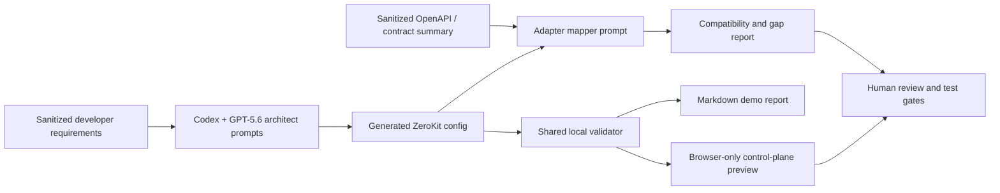

# ZeroKit AI Control Plane — GPT-5.6/Codex SaaS Architect

> Generate a privacy-preserving SaaS control-plane config, RBAC model, endpoint map, and adapter report with Codex + GPT-5.6.

This Build Week edition is a public competition adaptation of a private commercial ZeroKit codebase. The private donor product remains separate; this repository contains the selected and hardened judging/demo surface, GPT-5.6/Codex workflows, synthetic sample configs, local validation tools, and a runnable privacy-preserving control-plane preview.

## The problem

SaaS teams repeatedly rebuild the same administration infrastructure: roles, permissions, navigation, billing surfaces, configurable fields, backend routes, and release gates. A boilerplate may accelerate day one, but customer-specific edits quickly become scattered code and technical debt. One school, clinic, or agency can require a completely different role model, panel set, currency, table shape, and backend contract.

## The solution

ZeroKit treats these choices as a configuration socket:

- `panel_registry` controls enabled/visible panels, order, and navigation groups.
- `rbac_registry` defines roles and least-privilege permissions.
- `field_registry` describes fields, dropdowns, and table columns.
- `endpoint_map` maps logical panel keys to customer routes.
- `brand_config` carries non-sensitive product identity and locale choices.

Codex + GPT-5.6 acts as a developer-side architecture and test co-designer. It turns sanitized requirements and contract metadata into a reviewable config, highlights backend adapter gaps, and proposes evidence gates. It is not a chatbot attached to production admin data.

## Architecture



Route locations are flexible; response payload shapes are not. `endpoint_map` can point a panel at a customer route, but the adapter must still return the documented keys and nesting. This edition reports gaps instead of pretending arbitrary payloads are compatible.

## Privacy boundary

- GPT-5.6 receives only product requirements, synthetic examples, schemas, sample field/endpoint names, and non-sensitive backend contracts.
- GPT-5.6 does not receive production customer records, real user data, credentials, API keys, invoices, medical records, private messages, or confidential datasets.
- The browser preview validates pasted JSON locally and does not send it to an external service.
- The ZeroKit runtime and customer data remain on the user’s infrastructure.
- Every generated config is validated and manually reviewed before use.

See [privacy-boundary.md](ai-buildweek/reports/privacy-boundary.md) for sanitization and incident rules.

## Quick start

Prerequisite: Node.js 20 or newer.

```bash
npm install
npm run build
npm run test:unit
npm run test:browser
```

Validate all generated scenarios:

```bash
node ai-buildweek/scripts/validate-config.mjs ai-buildweek/examples/school-saas.generated.config.json
node ai-buildweek/scripts/validate-config.mjs ai-buildweek/examples/healthcare-saas.generated.config.json
node ai-buildweek/scripts/validate-config.mjs ai-buildweek/examples/agency-saas.generated.config.json
```

Generate and apply a demo-safe config:

```bash
node ai-buildweek/scripts/generate-demo-report.mjs ai-buildweek/examples/school-saas.generated.config.json
node ai-buildweek/scripts/apply-demo-config.mjs ai-buildweek/examples/school-saas.generated.config.json
npm run dev
```

Open `http://127.0.0.1:4173`. The apply script writes below `ai-buildweek/demo-config/`; it does not overwrite `config/zerokit.config.json` unless an explicit override flag and target are supplied. Existing demo targets receive a timestamped backup.

## Three-minute demo flow

1. Choose school, healthcare, or agency as a synthetic SaaS scenario.
2. Run the config-architect prompt with sanitized requirements.
3. Validate the generated JSON with the shared local validator.
4. Apply it to the demo-safe location.
5. Inspect enabled/hidden panels, RBAC, fields, endpoints, warnings, TR/EN, and light/dark behavior in the local preview.
6. Show the synthetic backend adapter gap report and the route-flexible/payload-strict rule.
7. Generate a Markdown report and show build/test evidence.
8. Close on the privacy boundary and required human review.

The full narration is in [DEMO_SCRIPT.md](ai-buildweek/demo/DEMO_SCRIPT.md).

## Evidence

Evidence captured on 2026-07-13 is recorded in [codex-build-log.md](ai-buildweek/reports/codex-build-log.md).

| Check | Result | Evidence |
| --- | --- | --- |
| `npm install` | PASS | 1 package audited, 0 vulnerabilities; lockfile created |
| `npm run build` | PASS | Static judging demo emitted to `dist/` |
| `npm run test:unit` | PASS | 8/8 Node tests |
| School config validation | PASS | 9 panels, 5 roles, 5 field groups, 8 endpoints |
| Healthcare config validation | PASS | 10 panels, 4 roles, 5 field groups, 8 endpoints |
| Agency config validation | PASS | 8 panels, 4 roles, 7 field groups, 7 endpoints |
| School Markdown report generation | PASS | `ai-buildweek/reports/generated-demo-report.md` generated locally |
| `npm run test:browser` | PASS | 16/16 assertions at 375×812: TR/light/healthcare, overflow, keyboard, privacy, negative JSON, network and runtime errors |

Playwright is intentionally not added to this selected static surface. The dependency-free Chrome DevTools smoke runner uses an installed Chrome/Edge binary (`CHROME_PATH` can override discovery) and does not claim that the private donor product’s broader E2E suite applies to this repository.

## Repository structure

```text
ai-buildweek/
  prompts/       GPT-5.6/Codex architecture, adapter, gate, and demo prompts
  examples/      Three synthetic inputs and generated ZeroKit configs
  reports/       Adapter, privacy, judging, and reproducible build evidence
  scripts/       Dependency-free validation, safe apply, and report CLIs
  demo/          Architect guide, 3-minute script, and screenshot checklist
config/          Public config contract schema
frontend/
  pages/         Isolated local control-plane preview
  js/            Shared validator, preview model, and browser controller
  styles/        Responsive light/dark preview styling
scripts/         Node-only static build and local server
tests/unit/      Shared validator and preview projection tests
```

## Why GPT-5.6/Codex is central

The AI is used where architectural reasoning creates leverage: translating requirements into a coherent permission/navigation/field contract, comparing backend shapes, exposing uncertainty, and producing a test plan. Runtime customer data is deliberately outside that loop. This makes GPT-5.6/Codex a config and verification co-designer, not an agent reading a SaaS database.

The four reusable workflows live in [ai-buildweek/prompts](ai-buildweek/prompts), and judge-oriented context lives in [judging-notes.md](ai-buildweek/reports/judging-notes.md).

## Scope and dependency honesty

This repository demonstrates a working, validated AI-assisted control-plane configuration workflow and an isolated preview. It does not claim that every panel in the private commercial donor product is part of this public edition or production-ready here.

The preview has **zero frontend runtime npm dependencies**. Development/test/build commands also use Node built-ins only in this edition. A customer backend, deployment stack, or the separate private donor product may have its own disclosed dependencies.

## License and private donor note

This public Build Week judging edition is licensed under the [MIT License](LICENSE). The separate private commercial donor codebase is not included and retains its own commercial terms. This license does not relicense or expose that private product.
