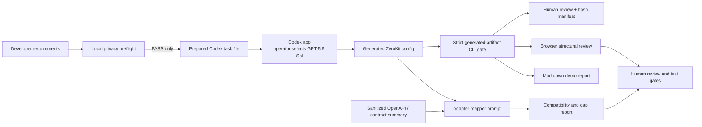

# ZeroKit AI Control Plane — GPT-5.6/Codex SaaS Architect

> Generate a privacy-bounded SaaS control-plane config, RBAC model, endpoint map, and adapter report with Codex + GPT-5.6.

Judge-facing notes: [Judging notes](ai-buildweek/reports/judging-notes.md) · [Privacy boundary](ai-buildweek/reports/privacy-boundary.md) · [Claim audit](ai-buildweek/reports/jury-claim-audit.md)<br>
Operator recording guide, Turkish: [Demo video roadmap](ai-buildweek/demo/DEMO_VIDEO_ROADMAP.md)

This standalone public Build Week judging edition draws on prior private SaaS-control-plane research. The separate private commercial codebase is not included or required for judging. This repository contains the submitted GPT-5.6/Codex workflow, synthetic sample configs, privacy and validation tools, adapter evidence, tests, and runnable control-plane preview.

## Recommended track: Developer Tools

ZeroKit is submitted to **Developer Tools** because its primary user is a developer or technical product team. The School SaaS example is synthetic demo data, not the competition category. The product packages bounded agent tasks, generates and validates configuration contracts, maps adapter gaps, enforces privacy gates, and exposes reproducible test evidence.

## Devpost submission evidence

- Track: **Developer Tools**
- Repository: <https://github.com/zyganali-glitch/zerokit-ai-control-plane>
- Demo video: public YouTube URL, under three minutes, with English audio explaining what was built and how Codex/GPT-5.6 were used
- Codex evidence: enter the `/feedback` Codex Session ID from the primary project task in the Devpost form; do not commit the Session ID publicly
- Build Week delta: see [build-week-delta.md](ai-buildweek/reports/build-week-delta.md)
- Testing path: see [LIVE_DEMO.md](LIVE_DEMO.md)
- Submission form guide: see [DEVPOST_SUBMISSION_GUIDE.md](ai-buildweek/submission/DEVPOST_SUBMISSION_GUIDE.md)

The optional Devpost Hackathons plugin can help prepare a submission, but it is not required, is not integrated into this product, and is not a product dependency. The Devpost website and Official Rules remain the source of truth.

## Live demo / no-rebuild judge path

**Live preview:** <https://zyganali-glitch.github.io/zerokit-ai-control-plane/>. The deployed project-subpath build was verified with anonymous HTTP checks and the repository's real-Chrome smoke suite. Judges can use it without cloning or rebuilding the repository.

## The problem

SaaS teams repeatedly rebuild the same administration infrastructure: roles, permissions, navigation, billing surfaces, configurable fields, backend routes, and release gates. A boilerplate may accelerate day one, but customer-specific edits quickly become scattered code and technical debt. One school, clinic, or agency can require a completely different role model, panel set, currency, table shape, and backend contract.

## Who this is for

| Stakeholder | Job to be done |
| --- | --- |
| Product engineer | Turn a sanitized SaaS brief into one coherent panel, RBAC, field, and endpoint contract. |
| Tech lead or security reviewer | Inspect permission and privacy decisions before any runtime integration. |
| Backend integrator | See exact payload assumptions and adapter gaps instead of an unsupported compatibility claim. |
| Delivery owner | Keep model use, deterministic checks, human approval, and evidence in one reproducible workflow. |

## The solution

ZeroKit treats these choices as a configuration socket:

- `panel_registry` controls enabled/visible panels, order, and navigation groups.
- `rbac_registry` defines roles and least-privilege permissions.
- `field_registry` describes fields, dropdowns, and table columns.
- `endpoint_map` maps logical panel keys to customer routes.
- `brand_config` carries non-sensitive product identity and locale choices.

Codex + GPT-5.6 acts as a developer-side architecture and test co-designer inside the Codex desktop app. Local tools first block high-confidence sensitive inputs and prepare a bounded task file; Codex writes the config in the repository; deterministic code validates it; and an operator-confirmed hash manifest records the reviewed result. No model API key or model API call is part of this workflow.

## Architecture



Route locations are flexible; response payload shapes are not. `endpoint_map` can point a panel at a customer route, but the adapter must still return the documented keys and nesting. This edition reports gaps instead of pretending arbitrary payloads are compatible.

Validator coverage and limits are documented in [validator-coverage.md](ai-buildweek/reports/validator-coverage.md). Backend evidence boundaries are summarized in the [adapter compatibility matrix](ai-buildweek/reports/adapter-compatibility-matrix.md).

## Privacy boundary

- GPT-5.6 receives only product requirements, synthetic examples, schemas, sample field/endpoint names, and non-sensitive backend contracts.
- A dependency-free local preflight blocks high-confidence secrets, tokens, connection strings, cookies, and non-reserved email addresses before the supported Codex app workflow. UUIDs and production-language markers require human review.
- The supported workflow runs inside the Codex app and never asks for or reads a model API key.
- The evidence manifest stores file hashes, validation statistics, the operator-confirmed visible model label, and the human-review state—not prompt contents, private files, or model reasoning.
- GPT-5.6 does not receive production customer records, real user data, credentials, API keys, invoices, medical records, private messages, or confidential datasets.
- The browser preview validates pasted JSON in the current tab and does not send it to a third party or model service; bundled samples load only from the same site origin.
- The ZeroKit runtime and customer data remain on the user’s infrastructure.
- The supported workflow requires every generated config to pass the strict generated-artifact gate and human review before use.

See [privacy-boundary.md](ai-buildweek/reports/privacy-boundary.md) for sanitization and incident rules.

## Quick start

Prerequisite: Node.js 22 or newer. Supported operator platforms are Windows, macOS, and Linux. The browser smoke requires an installed Chrome or Edge binary; the static Pages preview works in current evergreen browsers.

On Windows PowerShell, use `npm.cmd` anywhere the examples show `npm`; do not change PowerShell execution policy.

```bash
npm ci
npm run build
npm run test:unit
npm run test:privacy
npm run test:browser
```

Validate all generated scenarios:

```bash
node ai-buildweek/scripts/validate-config.mjs ai-buildweek/examples/school-saas.generated.config.json
node ai-buildweek/scripts/validate-config.mjs ai-buildweek/examples/healthcare-saas.generated.config.json
node ai-buildweek/scripts/validate-config.mjs ai-buildweek/examples/agency-saas.generated.config.json
```

Prepare the Codex app workflow:

```bash
npm run codex:prepare -- ai-buildweek/examples/school-saas.input.md --force
```

Then open this repository in the Codex app, select **GPT-5.6 Sol**, start a new task, and tell Codex to execute `ai-buildweek/runs/school-saas.codex-task.md`. The prepared task tells Codex exactly which sanitized files it may read, where to write the config, what not to access, and which validator to run.

After visually confirming the selected model and reviewing the generated config, record evidence. The multiline example below uses Bash/macOS/Linux syntax:

```bash
npm run codex:record -- \
  ai-buildweek/examples/school-saas.input.md \
  ai-buildweek/runs/school-saas.codex-task.md \
  ai-buildweek/evidence/school-saas.gpt-5.6.codex.config.json \
  --model="GPT-5.6 Sol" --confirm-model-visible --confirm-reviewed \
  --thread=school-demo-run
```

Windows PowerShell equivalent:

```powershell
npm.cmd run codex:record -- ai-buildweek/examples/school-saas.input.md ai-buildweek/runs/school-saas.codex-task.md ai-buildweek/evidence/school-saas.gpt-5.6.codex.config.json --model="GPT-5.6 Sol" --confirm-model-visible --confirm-reviewed --thread=school-demo-run
```

The evidence recorder accepts the exact `GPT-5.6 Sol` label only, but it cannot read Codex's in-app model selector. The manifest therefore labels model selection as operator-confirmed and explicitly not cryptographically verified. The video should show the visible model selector. Human review remains mandatory because no pattern guard can detect every kind of sensitive or misleading input.

Generate and apply a demo-safe config:

```bash
node ai-buildweek/scripts/generate-demo-report.mjs ai-buildweek/examples/school-saas.generated.config.json
node ai-buildweek/scripts/apply-demo-config.mjs ai-buildweek/examples/school-saas.generated.config.json
npm run dev
```

Open `http://127.0.0.1:4173`. The apply script writes below `ai-buildweek/demo-config/`; it does not overwrite `config/zerokit.config.json` unless an explicit override flag and target are supplied. Existing demo targets receive a timestamped backup. Staging a file does not auto-load it: click **Choose local JSON**, select the staged or fresh evidence JSON, and confirm that the preview reports PASS.

Run the open-source PocketBase adapter proof:

```bash
npm run demo:pocketbase
```

The checked-in synthetic fixture mirrors PocketBase's documented `items`/`totalItems` list envelope. The fail-closed adapter projects it to ZeroKit's strict `users`/`total` contract without a live database or real records. See [pocketbase-adapter-proof.md](ai-buildweek/reports/pocketbase-adapter-proof.md).

## Three-minute demo flow

1. Choose school, healthcare, or agency as a synthetic SaaS scenario.
2. Run `codex:prepare`, select GPT-5.6 Sol in the Codex app, and execute the prepared task.
3. Validate the generated JSON, review it, and create the operator-confirmed hash manifest.
4. In the preview, click **Choose local JSON** and load the fresh evidence output; optionally stage a demo-safe copy first.
5. Confirm PASS, then inspect enabled/hidden panels, RBAC, fields, endpoints, warnings, TR/EN, and light/dark behavior.
6. Show the PocketBase adapter proof and the route-flexible/payload-strict rule.
7. Generate a Markdown report and show build/test evidence.
8. Close on the privacy boundary and required human review.

The exact English voiceover source is [VOICEOVER_SCRIPT.md](ai-buildweek/demo/VOICEOVER_SCRIPT.md); the matching English shot list is [DEMO_SCRIPT.md](ai-buildweek/demo/DEMO_SCRIPT.md). The Turkish, click-by-click beginner production, text-to-speech, recording, editing, failure-recovery, and submission guide is [DEMO_VIDEO_ROADMAP.md](ai-buildweek/demo/DEMO_VIDEO_ROADMAP.md).

The competition video is under three minutes, public on YouTube, and includes English audio explaining what was built and how Codex/GPT-5.6 were used. The [official FAQ](https://openai.devpost.com/details/faqs) permits text-to-speech or an AI voice tool. Overlay captions are intentionally omitted so the recorded product evidence remains unobstructed; the official rules require explanatory audio, not captions.

## Evidence

Historical and refreshed evidence through 2026-07-16 is recorded in [codex-build-log.md](ai-buildweek/reports/codex-build-log.md).

| Check | Result | Evidence |
| --- | --- | --- |
| `npm ci` | PASS | 1 package audited, 0 vulnerabilities; lockfile reproduced |
| `npm run build` | PASS | Static judging demo emitted to `dist/` |
| `npm run test:unit` | PASS | 20/20 Node tests, including task/manifest rules, strict artifacts, privacy, PocketBase, and GitHub Pages subpath resolution |
| `npm run test:privacy` | PASS | 8/8 focused Codex-workflow and privacy-guard tests |
| School Codex task preflight | PASS | Task file produced, zero blockers/review findings, no model API call |
| In-app GPT-5.6 run evidence | PASS | Fresh [School SaaS config](ai-buildweek/evidence/school-saas.gpt-5.6.codex.config.json) and [operator-confirmed manifest](ai-buildweek/evidence/school-saas.gpt-5.6.codex.config.manifest.json): GPT-5.6 Sol visible in Codex with Ultra selected, strict validation PASS, human review complete, 8 panels / 5 roles / 3 field groups / 3 endpoints |
| Bundled School baseline config validation | PASS | 9 panels, 5 roles, 5 field groups, 8 endpoints; orientation fixture, not the fresh run |
| Healthcare config validation | PASS | 10 panels, 4 roles, 5 field groups, 8 endpoints |
| Agency config validation | PASS | 8 panels, 4 roles, 7 field groups, 7 endpoints |
| School Markdown report generation | PASS | `ai-buildweek/reports/generated-demo-report.md` generated locally |
| PocketBase adapter proof | PASS | 2 synthetic `items` → 2 `users`; `totalItems` → `total`; malformed shapes fail closed in tests |
| Required config validations | PASS | 3/3 synthetic scenarios |
| `npm run test:browser` | PASS | 16/16 assertions at 375×812: TR/light/healthcare, overflow, keyboard, privacy, negative JSON, network and runtime errors |
| GitHub Pages deployment | PASS | GitHub Actions `build` and `deploy` jobs completed successfully |
| Live Pages browser smoke | PASS | 16/16 real-Chrome assertions against the project-subpath URL; no third-party/model requests or runtime exceptions |

Playwright is intentionally not added to this selected static surface. The dependency-free Chrome DevTools smoke runner uses an installed Chrome/Edge binary (`CHROME_PATH` can override discovery) and does not claim that the private donor product’s broader E2E suite applies to this repository.

## Static preview deployment

The static judging surface is emitted to `dist/` with `npm run build` and deployed by the checked-in GitHub Actions workflow. The live Pages URL has been anonymously verified. The local workflow remains the source of truth for privacy checks, Codex task preparation, validation, and evidence. See [LIVE_DEMO.md](LIVE_DEMO.md).

## Repository structure

```text
ai-buildweek/
  prompts/       GPT-5.6/Codex architecture, adapter, gate, and demo prompts
  examples/      Three synthetic inputs and generated ZeroKit configs
  lib/           Privacy guard, Codex app task/evidence, and adapter modules
  reports/       Adapter, privacy, judging, delta, session, claim, and build evidence
  scripts/       Generation, validation, adapter, safe apply, and report CLIs
  demo/          Architect guide, voiceover, recording roadmap, script, and screenshots
  submission/    Devpost field drafts and final operator checklist
config/          Public config contract schema
frontend/
  pages/         Isolated local control-plane preview
  js/            Shared validator, preview model, and browser controller
  styles/        Responsive light/dark preview styling
scripts/         Node-only static build and local server
tests/unit/      Shared validator and preview projection tests
```

## Why GPT-5.6/Codex is central

The AI is used where architectural reasoning creates leverage: translating requirements into a coherent permission/navigation/field contract, comparing backend shapes, exposing uncertainty, and producing a test plan. The supported workflow prepares a local task, runs it in the Codex app with a visibly selected GPT-5.6 model, records provenance hashes after human review, and rejects output that fails the strict generated-artifact contract. Runtime customer data is deliberately outside that loop. This makes GPT-5.6/Codex a config and verification co-designer, not an agent reading a SaaS database.

The four reusable workflows live in [ai-buildweek/prompts](ai-buildweek/prompts), judge-oriented context lives in [judging-notes.md](ai-buildweek/reports/judging-notes.md), the claim-by-claim assessment lives in [jury-claim-audit.md](ai-buildweek/reports/jury-claim-audit.md), and the official submission-period disclosure lives in [build-week-delta.md](ai-buildweek/reports/build-week-delta.md).

## Scope and dependency honesty

This repository demonstrates a working, validated AI-assisted control-plane configuration workflow and an isolated preview. The final recorded School SaaS run is committed under [`ai-buildweek/evidence`](ai-buildweek/evidence): the operator visibly selected GPT-5.6 Sol with Ultra, Codex generated a fresh target, the strict validator returned PASS, a human reviewed the result, and the manifest recorded operator-confirmed hashes without claiming cryptographic model proof. The remaining submission-only steps are publishing the English-audio video and placing the private `/feedback` Session ID in Devpost. This repository does not claim that every panel in the private commercial donor product is part of this public edition or production-ready here.

The preview has **zero frontend runtime npm dependencies**. Development/test/build commands also use Node built-ins only in this edition. A customer backend, deployment stack, or the separate private donor product may have its own disclosed dependencies.

## License and private donor note

This public Build Week judging edition is licensed under the [MIT License](LICENSE). The separate private commercial donor codebase is not included and retains its own commercial terms. This license does not relicense or expose that private product.
